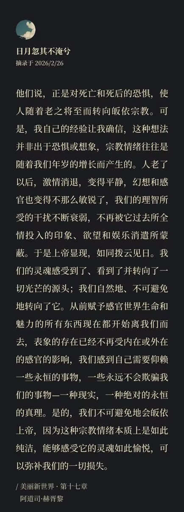

+++
date = '2026-02-26'
draft = false
title = '【读书笔记】《美丽新世界》'
+++

美丽新世界》的故事背景设定在2532年的人类社会。它是个统一而和平的世界性国家，科技高度发达人民安居乐业，物质生活十分丰富。除了男主生活的"文明社会"，还有"蛮族保留区"，主要居民是一些印第安部落成员。伯纳和列宁娜去保留区游览时遇见了约翰和他的母亲琳达。琳达本是新世界的居民，在游玩时因坠崖而从此留在了保留区生活，并且生下了约翰。伯纳出于个人目的将其母子带回新世界，而琳达很快因为服用过度索麻（这个东西有人解释成兴奋剂，但我觉得它其实是一种理想的、无副作用的镇定剂，服下后可以进入数小时的美妙幻觉，可以去除一切负面情绪，帮助人重整旗鼓）去世。约翰对新世界也由崇拜转为厌恶，最终自缢身亡。

《娱乐至死》中曾这样比较《1984》和《美丽新世界》：奥威尔预言的世界比赫胥黎预言的世界更容易辨认，也更有理由去反对。我们的生活经历已经能够让我们认识监狱，并且知道在监狱大门即将关上的时候要奋力反抗。但是如果我们没有听到痛苦的哭声呢，谁会拿起武器去反抗娱乐？当严肃的话语变成了玩笑，我们该向谁抱怨，该用什么样的语气抱怨？赫胥黎在《美丽新世界》中担心真相会被淹没在海量的琐碎信息、无意义的娱乐中。他认为在这样一个科技足够发达的时代，根本不需要有《1984》那样的"老大哥"压迫我们，只需要给我们足够多的感官享受，我们自己就会放弃思考。

新世界的科技已经高度发展到可以用机器按批次生产出不同种姓的婴儿，以通氧量的多少来调整不同阶级婴儿的智商和思维能力，外加上婴幼儿时期的睡眠教育，在低种姓的孩子心中种下"享受生活"、"尊敬高种姓"和"我满意现有一切"的观念——"阿尔法孩子们穿灰色衣服。他们比我们工作更勤勉，因为他们非常聪明。我很高兴我是xxx，因为我无须那么辛苦工作……"——从而使其天然地服从领导者的意志。阿尔法到奥普西隆（希腊字母前五位，按照阿尔法、贝塔、伽马、德尔塔和奥普西隆从上到下分为五个阶层）享有的权利不同，但依然能维持社会稳定，不产生抗争，不仅是因为低种姓智商低，也是因为此时生产力高度发展，每一个阶级虽然生活条件略有差异，但归根结底都享有生存之上的自由和追求幸福的权利。政府按时派发索麻，人们已经被睡眠教育在潜意识中种下了"吞一克索麻胜过吃一次瘪"的观念。他们看能直接给大脑皮层带来愉悦的感官电影，享受着无可指摘的物质生活，并且习惯于用索麻排忧解难。

在这样一个没有生存危机而充斥着海量琐碎的娱乐信息的世界中，我们该用什么样的理由去反对感官享受？有人说，幸福应该被视为某种必要的副产品，如果你专注于它就会迷失方向。而新世界的统治者们就是用这样的手段来维持社会稳定。这和《商君书》中的御民五术迥然不同，他们不愚民弱民疲民贫民辱民，而是直接给予无须思考的幸福，让他们无暇旁顾。将其转移力转移到对幸福的专注中，使其不必要从争夺权力和地位的过程中获得少量的愉悦。他们摆脱了痛苦，也摆脱了严肃思考。就算生活在社会的最底层，也不会因为自己的利益受损而心怀怨恨。

我觉得最有趣的一点，是赫胥黎在书名上用了一个引用，是有点像乔伊斯《泥土》那样暗示主题/结局的东西。书名的原词在我们中文语境中很难看出来，美丽新世界，其实对应的英文译名是「Brave New World」，而不是「Beautiful New World」，该词组来源于莎士比亚的戏剧《暴风雨》。而这部剧也讲述的是一个发展程度较低的小岛的居民误入美丽富饶的大陆城市，随后发现实在金玉其外败絮其中的故事。我想赫胥黎大约也有以此影射所谓"美丽新世界"的目的吧。总的来说，这本书真的非常好、非常值得一读。其中有许多引人深思的问题，在此不一一列出分析。而且其实对于当今时代的我们来说，这本书的科幻程度并不高，更能在阅读时沉浸式体验其中种种。
