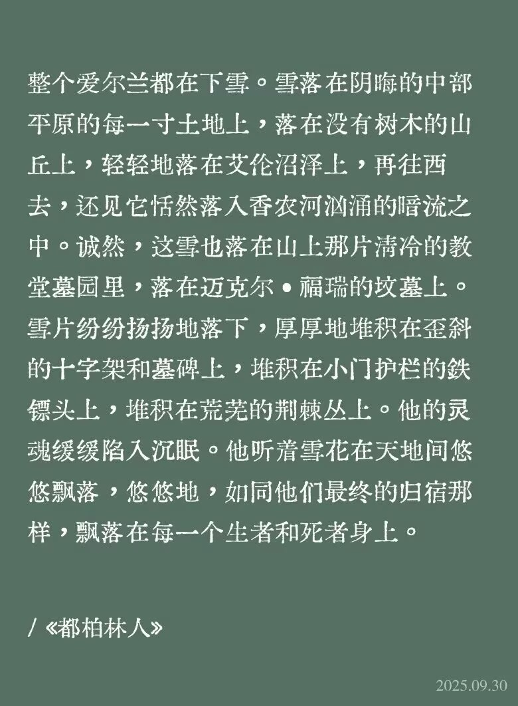

+++
date = '2026-02-06'
draft = false
title = '【读书笔记】《都柏林人》'
+++

之前读了乔伊斯的《都柏林人》，在学校已经做了一个有些仓促的读书分享，但最终还是决定像这样简单地写一些话来表达一下。文学中下过的雪太多了，但我认为《都柏林人》最后一篇《死者》中的这场雪，或许能算得上文学史上最著名的几场雪之一……在读的时候觉得很痛苦，但是过后看了一些别人的解读以后又发现他们提到的隐喻确有其事，或许这本书原本也没有那么复杂，只不过是所讨论的其中一部分问题具有时效性（有时候甚至是读者不能理解那个时代，进而不能理解文学本身）；不过在我忘了是前言还是什么地方的一段话里，文章的主旨内容大概就能从乔伊斯说的“一个不配拥有希望的城市，住着精神瘫痪的人”的管中略略窥见其一二了。

我们学校选的文章是《阿拉比》和《泥土》两篇。虽然说《都柏林人》是短篇小说集，但是其中的每一个故事确实又有一点相关性。比如说排在第三篇《阿拉比》实际上就是前两篇故事的一个延续。“我”喜欢朋友的姐姐，但是在阿拉比市场见到那里无所事事的、和女子调笑的男人，立即从自己长期受到的天主教的规训下萌生出一种罪恶感，并把这种正常的情思视作情欲和背德。此前“我”家的一个房客死在了住所，他是一个捐赠了所有遗产的牧师。这个人——或者这个人的死给“我”带来了一种“洗涤”，因此在阿拉比这样一个俗世的世界里，看到那一个女人和两个男人空洞的虚浮的对话，“我”的爱情梦被击碎，并且为自己献媚的虚荣心而痛苦。

因为那不属于“我”接受的思想的教育，“我”所接受的是带有荒凉感的奉献，和无欲的自我压抑，最终的结局大约也就会像那个青年牧师一样。或许是因为母亲信奉天主教，最终在无尽的循环的生育中度过了并不十分明了的一生；而父亲曾追随新教的领导人进行解放运动过一段时间，但最终也是随着领导人爆出丑闻以后惨淡收场。乔伊斯生活在一个观念杂合而冲突的世界，并由此写下了许多关于教派和信仰的小说。正如他对天主教有些揶揄，但并不是恶意或者取乐，而是深受影响，却又感到对自己过往体系的怀疑。

又说到《泥土》，主要讲的是一个叫做玛丽亚的女人在天主教或者新教的“洗衣店”工作——此处的洗衣店，指的不是我们世俗意义上的洗衣店，而是对不良失足女子或者妓女的收容所。晚餐后她和孩子们（领养的，现已成家）一起玩一个占卜的游戏，这种游戏有点相似抓周，摸到的每一个东西都有不同的象征；比方说摸到水是要远行，摸到金币会发达，摸到泥土则代表着有人要死去，而摸到祈祷书则代表着要成为修女。玛丽亚具备了圣母的形象的奉献品质，但乔伊斯又给了她人的欲望（这一点是体现在她在电车上老绅士产生的悸动中）。

她困惑自己身体和灵魂的分裂，每一个人都推着她往圣母节欲的方向去，即使是她的孩子们也没有允许她身为“人”的这一部分存在。摸到泥土代表着玛丽亚自身的死亡和归于圣洁的终结。但还有一种解释是摸到了蛞蝓，未婚的小女孩会用它来占卜自己未来丈夫的形象——因此可以说她摸到的是这样一个早期的少女般的情欲暗示，但家人不希望她这样，他们觉得她理应是奉献的圣母——占卜游戏的结果并没有在小说中明确揭露，但我还能更倾向于玛丽亚摸到了泥土，这是乔伊斯给她的注解，对她疑惑的解答：“唯有死亡可以结束她的欲望。”
