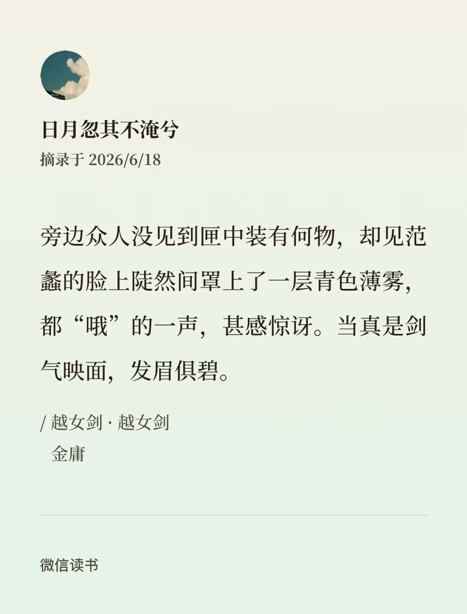

+++
date = '2026-06-20'
draft = false
title = '【读书笔记】《越女剑》'
+++

读这本书的起因是有段时间我们学校的美文材料征集学生们的文学类作品推荐，其中有一次是《越女剑》的节选。这一篇只有1.6万字，篇幅不长，但那次的节选很明显是没有选好，搞得人看完之后摸不着头脑。很长一段时间以后，我又想起这本书来，这才把它看完，解答了当初的疑惑。

这篇看名字就知道，讲的是一个越国女子和她的剑的故事。故事发生的背景并不是人们惯常所知的以宋元为背景的金庸江湖，而是先秦时期的吴越争霸。此时勾践已败于吴王，卧薪尝胆，欲报此仇。假借比剑的名头试探吴国军力，结果一战之下，八名越国好手尽数被歼。吴国的铸剑技术天下无匹，外加对孙子兵法的妙用，称霸于时。吴国使者留越时一直耀武扬威，一日喝醉酒了还拦住范蠡在街上闹事，不一会就杀光了他的甲士。此时一个叫做阿青的少女赶着羊经过，无意中的几句话激怒了使者，叫人把她的一只羊对半劈了。阿青看见羊被杀也非常生气，用手中的竹杖几下击败了使者，还戳瞎了为首之人的眼睛。范蠡看后大吃一惊，连连说我帮你把你的羊葬了你来教越国的兵士们练剑行不行？阿青颇有些动容，最终还是答应了。但其实说是“教”，也只是阿青拿着竹杖和兵士们对练。后来范蠡又请到一位大师为越国铸剑，在有了比吴国更好的剑之后（这一段我不确定具体剧情是不是这样，只记得大概），再辅之以阿青教授的剑术，越国成功战胜了吴国。

天下已定后本该是小家团圆，但范蠡此时已经知道阿青喜欢自己了，收到她说必杀西施的性命的字条以后夙夜忧叹，最终决定和西施共同面对这个十死无生的结局。阿青在一个有风的夜晚里如约到来了，本来是杀气腾腾地要取走心上人之爱的性命，但她被西施的美貌惊呆了，急忙撤回刺向西施心口的竹杖，翻出窗跳走了，从此消失于夜色。而西施的心绞的病，据说就是从那时得来的。

在我这样概括以后，整个故事依然显得很抽象——阿青为什么会爱上范蠡，为什么决定要杀掉西施，还有为什么在看到西施的脸以后决定成全他们两个？归根结底还是因为没办法彻底将原作细节一一复述。首先是第一个问题，阿青爱上范蠡其实就是因为他同意帮她安葬她的羊，甚至还把那一小块墓地修得像模像样。尤其是在先前吴国兵士的衬托下，范蠡的善意触动了她，后来在教剑的过程中又和他相处了好一段时间，自然就产生了“爱”。而之所以要杀掉西施，也就是因为她作为一个年纪不大的女孩，依然有着对“一生一世一双人”的期待，因此想要铲除对爱情的一切干扰。看到这里，有些人可能会好奇：为什么她会做到如此地步？而我想，所谓“江湖气”就建立在这样的行为风格之上。

江湖中人的特点是什么？是快意恩仇。相较于习惯于压制情感的现实生活，江湖就显得坦荡得多。因为不压抑情感，所以显得快意；因为擅长对情感身体力行，所以显得爱恨鲜明。人疲惫了之后感官会被磨损，连带着对外界的一切情感都变得很鲁钝，因此对情感有着高敏感性的江湖中人才会显得那么神采飞扬、意气风发——我们把这种强应对能力和良好的精神状态挂上了钩——他们活跃的心很容易被细节所触动。而正因为容易被触动，所以往往会显得有些“偏执”，所以会在江湖世界中出现那么多愿意为了一件小事奋斗到底、兀兀穷年的人。对于阿青来说，这种触动带来的爱情来得快去得也快。来的时候不需要海誓山盟花前月下，去的时候自然也就不需要悲天恸地黯然魂销。西施的美在那一瞬间带来的震悚，远远大于了她对范蠡的“爱”——这一段阿青究竟在想什么，作者做了一个留白。我觉得比起说她自惭形秽，认为范施二人更加般配，更不如说就是这样的惊鸿一瞥填补了她心中因失去爱情而产生的空缺。有点像是陀思妥耶夫斯基《白夜》里描述的那样，“整整一分钟的狂喜啊！这难道还不足以让人享用一生吗……”

这篇小说很有趣，实际呈现出来的东西会比我在此描述出来的要多。推荐大家读一读。
