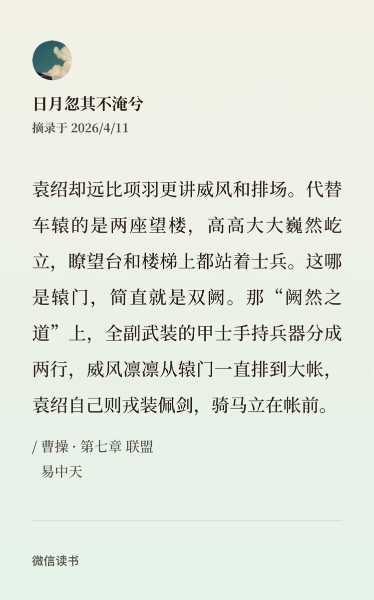

+++
date = '2026-04-19'
draft = false
title = '《曹操》吐槽向'
+++

叫《曹操》的书很多，各有千秋，但是光拼神人程度，我不知道还有多少本面对着易中天的梦幻草草攻向长篇历史小说还有一战之力。所以今天的这一期是一个混合了爱恨的吐槽向。易中天你真的又赢了，那么早以前就掌握了当今迪化文的套路。实在佩服。但说到优点也不是没有——阅读的过程中会有易大师实时讲解，书中出现的一些特殊读音和名词都会解释得非常详细，阅读起来没有什么困难。这是为数不多能让人单独提出来表扬的优点了。

这本的内容是从草草刺杀张让未遂开始叙述。算准了张让的休沐日，在大白天穿着夜行衣上门行刺，谁曾想张让这个时候正在宫里料理何进，美美躲过一劫。草草从张让家下人口中得知此事，顿时大感speechless！摸了摸鼻子留下行刺用的短匕和一个喷嚏离开了。随后袁绍以一个“身材修长，面容姣好，不笑而倩，不怒而威”而极具头雁气度的雍容贵公子形象翩然登场，印象中似乎是为后续的一个小趴体做准备。易中天在这里就差把“人生赢家”四个字刻在本初脑门上了，还要拉踩一波说你别以为前文描述的这些是小事，当今风尚以貌取人，像草草那样其貌不扬还不修边幅，怎么行？

不修边幅倒还是小事，可是后面接二连三的喷嚏到底是怎么回事？反复提醒读者这是小巧思的行为无可非议，但它出场频率是否过高？按理说这个时候一定是要往草蛇灰线伏笔千里那方面去猜了，奈何人鬼殊途，我始终够不上易中天精妙绝伦的脑回路。这本书分为三册，分别是上中下，上册的前一百页写得差强人意，不算特别吸引人，阅读过程略微如坐针毡。但好歹是四平八稳地发展到了董卓讨伐战。

前面智斗有智但感觉没写好，想要临危不惧出人意料结果写成一只跳跳虎两条脆脆鲨。而且给草草加这个打喷嚏的人设我是真的是在无法理解，他没点出设定用意的时候我都觉得易中天是脑残，然而用意一点出来也是雷霆至极，什么叫外部百毒不侵、内部心又软，对冲产生的喷嚏。看完我都懒得喷了，大哥你随便吧，心软在哪里，被你杀了的边让韩馥等人就看着你也不说话。

而且我真的很难理解到底为什么又要虚构出一个叫无盐的女主。她第一次出场是扮演劫匪头头，然后来刺杀董卓的妻子。然后被吕布和草草同时看上，但是这个“看上”迄今为止都没有后文，我都不知道他到底在这里是一个什么用意。后面草草受了一个很重的箭伤，赶路途中刚好碰到无盐，就送他去旁边的一个小村落看诊，刚好遇到华佗，刚好需要缝针，刚好缝合线用完了。于是要“借头发一根”。我也觉得很奇怪呀，大哥，你这这说重不重，说轻不轻的。你欠人家一根头发，你他妈你怎么还呢？哎哟。为啥还要在遇到她的时候强调一下“欠姑娘青丝一根”？这个时候你也没有誓天断发啊，你年纪多大了头发掉完了拔几根头发的事死活做不到是不？到底在拉扯什么。

这个头发发挥过暂时作用以后其实是取出来了，但就是不知道是扔了还是珍藏。朋友说拆了就扔呗，老曹那么多女人。我微微一笑说应该是珍藏了。因为易中天写的这个草草一辈子除了妻子卞夫人只对无盐和经典张绣的叔母动过心。。。老处男一枚啊！最搞笑的还不是这个，而是他想尽办法把草草其他大老婆小老婆全部模糊处理，连在宛城之战为了救爹地命丧黄泉的小昂哥也是只上线一秒钟转瞬即逝。

话又说回来，这本书真乃易中天协心本愿。先卖曹袁，后卖曹荀，穿插曹惇，略带曹洪，最后神之一手再来一波曹协。大哥你看这个人数对吗？当年《三国的星空》大家以为你会卖曹郭荀红白玫瑰风格，结果掏出一个曹协开始发狠了忘情了，原来你在这本书里就有这么明显的暗示啊！！而且这个东西一共三本，我现在第二本看到四分之三，感觉他（指草草和易中天）放不下袁本初。
（朋友：白月光嘛！我：卧槽）

虽然在后文中丁夫人也有出场，但更多是扮演一个背景板。我觉得无论谁家的粉丝洗地都得学习一下易中天这种忘却道德忘却历史挽尊到不知天地为何物只顾给老曹找补的精神，连宛城都能洗得如入无人之境，简直是可歌可泣。官渡之战虽然依旧是经典风味，但总有一种隐隐约约而挥之不去的迪化气息——全三国智商降低五十个百分点唯独曹营和即将加入曹营者不变的诡异感，这里的人都是正常的吗？而且到底为啥又要让这个神秘的女主出现一次啊。之前有一个视频，讲的是想要让两个人产生cp感就得要让两人的命运始终交织在一起，但我还是那句话，女主简直就像草草的喷嚏一样因为过高的出场率反而在我心里激起了一种难言的疑惑，在我以为她终究是闲云野鹤江湖中人，要事了拂衣去深藏功与名的时候，她却和草草一起站在城墙上，谈起了未来和理想。谈着谈着草草忽然问，那你想要什么？你想要的，我都会给你。女主微微一笑，我想要一个家，你能给我吗？

看到这里，我顿时失去了言语的能力，连骂都没力气骂了。吕本中说惟变所出万变不从，我想说其实从某种层面上来说，易中天也贯彻了这个概念，只不过是从相反的方向：千变万变最终都归结于是我想当一个好女人更想和你有个家。草草在听后甚至还真的思考了一下，想十年后卞夫人的孩子们都长大了，那我和无盐或许真的能效西施范蠡泛舟于江诸。

这前因对后果堪比驴头对马嘴，令人看完站起来大叫一声三军听令读完这段文字战至最后一刻自刎归天！简直不亚于秦王政为了一个女人为了长生放弃六合大业，比起说让草草寄情山水，找一个智勇双全的女人为你上得厅堂下得厨房，还不如上大汉官网搜索现任大将军个人简历，点开下面的邮件地址，滑跪后发送求婚短信，忍辱负重想尽办法最终吃得对方绝户然后继承谋士武将还有米其林三星大厨让他们全部为你洗手做羹汤。在这种不间断的绝望堆积下，我的意志力和忍耐力竟然也在这种经得住风雨洗礼的虐待中到达了一个新的高度，即使在不经意中悄然发现这场对话并不是在秋风萧瑟的城墙上，而是云雨初歇的卧房里时，也只是闭了闭眼睛，叹了口气，翻开了下一页。
