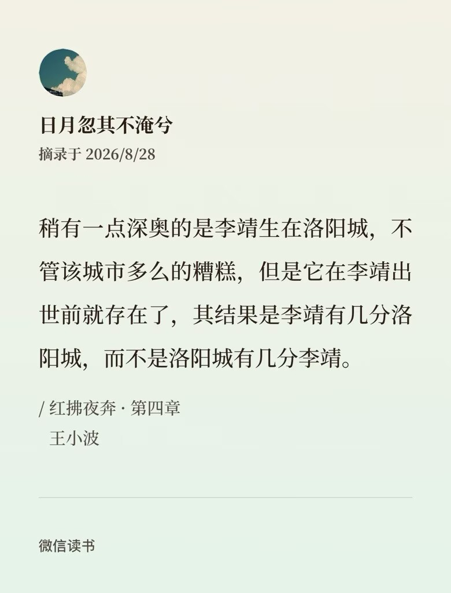

+++
date = '2026-08-30'
draft = false
title = '【读书笔记】《红拂夜奔》'
+++

总得来说，这一本书真的很“先锋”，无论是手法上还是内容上——其实我也是在看完这本书，才明确地感知到所谓先锋二字的。本篇中有部分内容是来自于我上次随手写的那篇读书笔记，但是增加了对原典的考据（稍稍）和衍生思考，重写了谈论“性”的部分。当时一位对文学很有见地、而其意见往往也与我相合的朋友在我的那条帖子底下说：这（指王小波《红拂夜奔》）是我最喜欢的书。因此我决定要沉下心来仔细阅读，试着从中寻找值得学习的部分。而值得高兴的是，我找到了。于是我稍作整理，重写了这一篇笔记，同时也向未来的自己提出警示：要始终保持谦逊。

这一篇新的笔记就是在这样的心情之下写出来的。尽管依旧有一些看法显得相当主观，但希望它们也能实际地给大家带来一些启发和帮助。

我在之前的帖子里说，这本书有R18要素的摩登唐朝，但其实这种描述并不准确。因为“性”本身就是作者谈论和探讨的对象之一，只是我还没办法完全理解。文中的“我”是王小波的一个同名化身王二，而李靖跟红拂呢又确确实实地活在生活在公元618年的唐朝，只是他们的生活被作者用一种较为摩登的方式写了出来。这种“摩登”在近现代作者的笔下有着广泛而多样的运用，其中大致包含了①在古代背景下广泛使用现代化词汇，让故事更具有现代特色，但本质上还是古代背景。比方说鲁迅《故事新编》中《大禹治水》。②借用古文中的一句话来当题头或者中心句，本质上是现代背景。比方说张爱玲《流言》集中的《有女同车》与《道路以目》。③这种本身是富有古韵的近代背景作品，作者多半有过留学经历，善于通过在叙述中增加外文的专业词汇来提升文章的格调。比方说郁达夫和徐志摩。

但是王小波这一篇其实并不属于以上任意一种，我认为它是有点在唐朝本身繁荣的背景中放大了“兼容并包”这一特点，从小处着笔，始终不把视角拉高写过于广阔的政治场景（不是说不拉远的意思，作者还是经常有把自己提出来观望着这一切的。详情请见配图）。其实我觉得这样还挺难得的，因为有很多作者一写这种古代背景就非要表达什么光伟正展现什么黑残惨，一堆屁话下来居然还要批判社会现实，每次故事都没写清楚就忽然懂王人格上身开始唉美女唉美国唉美帝了，唉美女甚至还是标志着作者进入读秒瞬间的必备情节。这里点名批评马伯庸。

我本以为《红拂夜奔》会是一个具有巨量文学气息且足以荡人心魄的历史小说，就好比冯至的《江上》。但其实创新的部分有很多，比方说这种两相对应的写法。“我”（王二）和李卫公对映出现，当代社会和唐朝对映出现。有些历史小说会很容易因为历史的“必然性”和人的劣根性而带给读者一种沉郁的观感（比方说《我的帝王生涯》，虽然这个不算完全历史，但观感也是和前面描述的相符合。当时在班会课上溜号看完，毫不夸张地说在当时那个恍惚的瞬间我真感觉我的一生简直就像尿一样流掉了），但本文中王二的不时出现、和并不那么正式规范的表达让这本书看起来很活泼，而且这种特殊的写法很便于开掘角色被压制在外界之下的另一面（xhs上有一个万赞帖子叫做“蘩漪假说”，这一篇明确说是仿《红拂夜奔》作的，有兴趣的大家可以感受一下）。

“红拂女”的典故是出自《太平广记》第一百九十三卷豪侠一。原本讲的是隋炀帝游幸江都，命司空杨素留守西京。而杨素持贵骄横，在李靖来献策的时候依旧是倚在床上接见他。他先是对杨素说你作为重臣应该以网罗天下能人为己任，不可以倚在床上见客。杨素这才收敛容色，站起来和李靖交谈。等他离开，一旁站着的一个执红拂的女子目送他出去，询问了李靖的身份以后也离开了，在夜里离开司空府投奔了李靖。“红拂夜奔”这四个字大约就是来自王小波的这一本书了。有人说认为夜奔的意象在中国文化中是无可替代的，因为它和向往无视后果的自由紧密相关——而这种自由对于深陷于现代规律性生活的桎梏中的我们，又显得弥足珍贵，比其他任何都更加值得向往——无论是都市生活的车水马龙，还是高端社交场所的酒痕花气，都比不上在夜里奔跑着离开寓所、回头眺望过去时气喘吁吁的那一瞥。

我觉得或许一些历史典故的意义就在这里，无论是什么时候都能以不同的角度旧事重提，无论有多少次麦子成熟依旧是历久弥新。

总之呢除去性学部分我始终没办法理解意外，这本书十分有新意，值得一看。我想要在未来的作品中进行一些仿写，但又觉得要仿写其实很难，有些像虚实结合，虚的部分首先要有背景或者底蕴，而实的部分背景又不能很复杂，一句话讲不清楚。不管怎样，我自认为在这本书的阅读中学到了很多，至于其他，以后再说吧！
