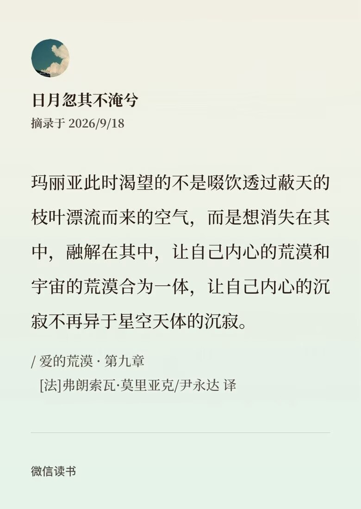
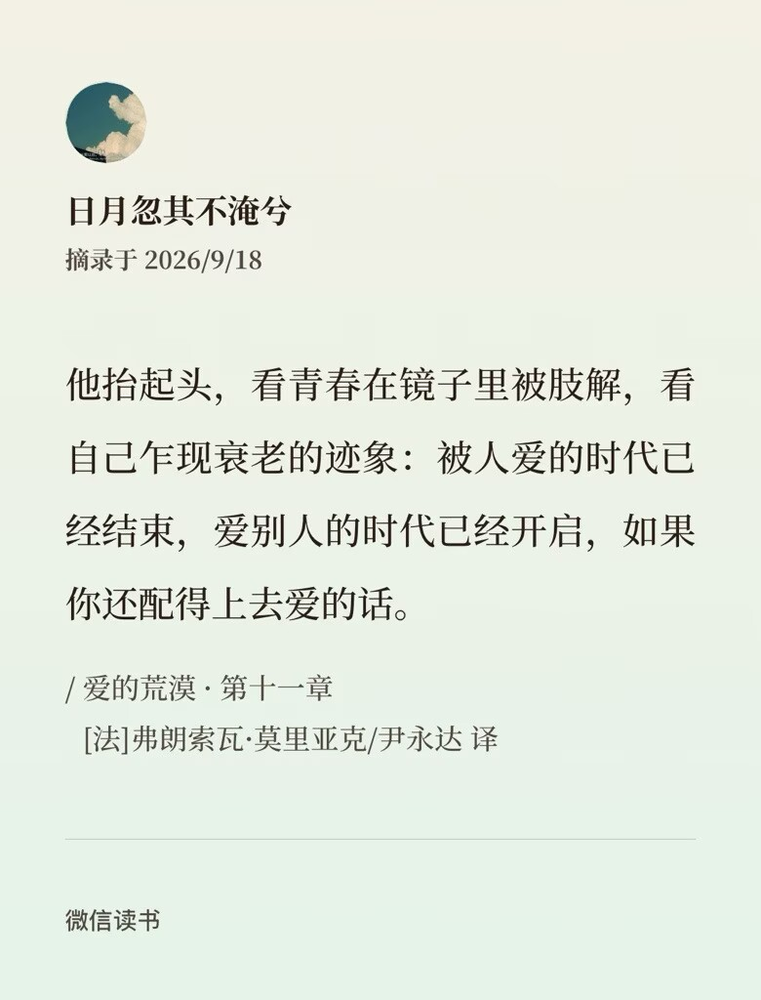
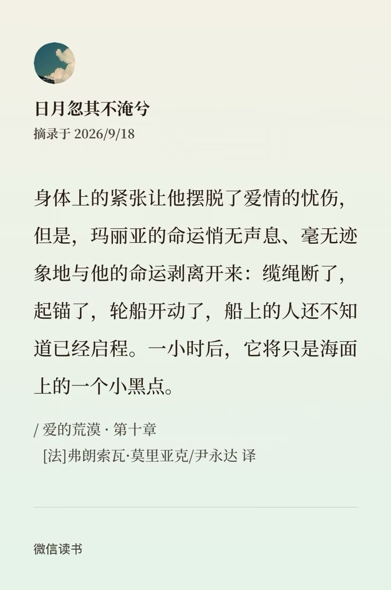

+++
date = '2026-09-21'
draft = false
title = '【读书笔记】《爱的荒漠》'
+++

看标题就相当沉重啊，因此想要用轻松一点的语调来谈论这一次的故事，但还是写了这么长。

一切的起因是某天我看到有人推荐书目。那里面每一本的概括看起来都狗血至极，很符合我的俗气口味。于是我在精心挑选了译本以后，开始了这次的阅读（看莫里亚克的书我都推荐尹永达的译本，不仅没有冗长的译者序，且都非常出色。

其中的用一句话来概括《爱的荒漠》，是说爸爸的情妇结婚了新郎和继子都不是我。“我”，即男主雷蒙·古雷热，女主是时为他人情妇的玛利亚·克罗丝。故事算是倒叙，从时年三十余岁的雷蒙走进一间酒吧开始。在这里，他遇见了一个叫做玛利亚的女人，这让他回忆起当年的那场疯狂的感情纠纷。于是时间线拨回到十七年前，回到故事的主线。简单来说，玛利亚原本在城中寡居，为了拿到钱给她儿子治病、顺便让他能呼吸到乡下的新鲜空气，她成为了当地某郡望的情人，因此名声很臭。而老古雷热是当地有名的医生，和玛利亚是普通医患关系；雷蒙则是在一辆电车上和她相遇，因为对方那卓然不群的气质生出了好感，后来在谈话间才了解到她的身份。其中有许多细节不便展开，我想还是把重心放在“爱”与“荒漠”这两个关键词上。

虽然这个一句话概括显得特别狗血，但实际上我认为它还不够准确，因为玛利亚并不是古雷热医生的情妇。他们两个不仅没有肉体接触，甚至连一次精神上彻底的全面的交流也没有过，只是古雷热医生一厢情愿地把心寄存在这。

首先从这个医生说起。他声名远扬，在学术上颇有成就，同妻子、母亲、女儿一家和当时年仅十七岁的小儿子雷蒙住在一起。作者在引言里说，“死亡并不会夺走我们爱的人，相反，它替我们保留着，将他们永远定格在可爱的青年时代：死亡是盐，可以储存爱情，生命才会将爱情稀释。”其后半句与医生的故事正好贴合。妻子困顿在生活的琐事里久久不能抽身，在他迫切想要谈一谈真心、以排除内心的空虚时始终控制不住抱怨，让他倍感疲惫。他们的爱情被生命（倒不如说是被琐事）稀释，他才想要一个人来了解他的内心，要将这份爱移到别人身上寻求承载。在他的部分中，这种被了解欲与精神上的性欲望有一定关联的，他希望妻子能回应其中之一，但妻子不能；实际上玛利亚也不能，但她被动地回应了第二部分，于是医生表现出卑微的姿态，对她产生了进一步的期待。

人处于“爱的荒漠”时，还有一种体现就是情感漠视。通过阅读上文，大家可以知道古雷热医生在面对他妻子的时候就表现出了十足的漠视。在文章的最后，他和自己的儿子谈话，劝他结婚，理由是“你不会明白活在家人的簇拥中是多么惬意”。是惬意，不是幸福。我想，这或许可以算是到了最后他依旧用伪善的道德包裹自己，没有学会如何去爱，也不懂得如何去接受爱。作为既得利益者，家庭只是他逃避痛苦的工具。相较而言，玛利亚的这种漠视更多是出于一种移情。她丈夫去世了，最爱的儿子也去世了，他们被永远定格在可爱的青年时代。她把这两个缺位的角色同时投射到雷蒙这个十七岁的少年身上，从和他的关系中“能感受到自己的存在，这就是她从这份爱情中所能收获的菲薄的幸福”。当然，既然这种爱情是投射的结果，它就必然有不真实性。长期以来她爱的那个雷蒙·古雷热其实只是她幻想中的角色——等到幻象成为泡影、现实重新裸露，这场“爱情”闹剧便将迎来终局。

我认为本书中最能体现“爱的荒漠”这四个字的角色其实是玛利亚。幻灭之后，她花了几天用来恢复。她已经摆脱了以往的那种狂热，便对雷蒙的情感施以漠视，回归到她爱的荒漠里去。“玛利亚此时渴望的不是啜饮透过蔽天的枝叶漂流而来的空气，而是想消失在其中，融解在其中，让自己内心的荒漠和宇宙的荒漠融为一体，让自己内心的沉寂不在异于星空天体的沉寂。”她想要和他人产生深度连结，然而在这种情况下人和人之间无法跨越的隔阂构成了荒漠。有人将其描述为通过回归来逃避自身的痛苦，这让我想起《赤壁赋》：寄蜉蝣于天地，渺沧海之一粟。让我的虚无和痛苦暂时归于广大吧——古今中外的这种痛苦从某种层面来说竟然如此趋同。

“在我想拥有的人和我之间，阻隔着一片恶臭熏天的疆域，阻隔着一片沼泽，阻隔着一潭泥浆。他们不明白……他们以我是为了和他们一起沉沦而召唤他们的……”玛利亚的痛苦和《西西里的美丽传说》女主的痛苦感觉上有些相似。她在广场点烟，希望有人能通过劝阻把她拉回正轨；然而人们都围上来给她点烟。她认为一段健康的关系中性和爱应该要是一体的，误认为可以从性中寻找爱。她对没有爱的性关系非常厌恶，转向心灵的交流……这种爱究竟是什么呢？按照莫里亚克的描述，大约算是一个萝卜一个坑：“其实我们心中只有一份爱情。我们只能在和他人的相遇、相识，以及交谈中随机拾获可能与这个爱情标准相符的关系。”

她的这种情况看起来是最不可能得到幸福的，相反，她是唯一得到了世俗和精神双重意义上幸福的人。郡望的妻子死了，她在婚姻上飞黄腾达。丈夫的生态位被重新填满，而继子伯兰特则是一个文静而虔诚的教徒，是她仰慕着的那个“圣雷蒙”的样子。

于是，到了十七年后，面对“凡人雷蒙”的或撩拨或挑衅时，她是如此无动于衷。而雷蒙对她当年幻灭后的拒绝却始终无法忘怀，一直等待着一个“报复”的机会——由此出现了“爱的荒漠”的第三种形态。在这过去的十七年里，雷蒙游走于各种各样的女人当中，做着各种各样并不长久的工作（其实我觉得这有点像受情伤后成为牛郎，他觉得当时玛利亚玩弄了他，后来他就通过玩弄别的女子的爱来试图实现自我价值）。雷蒙在他少年时期其实很自卑，尽管长得特别帅本性也不差，但就是被认为是小混混各种歧视，他干脆就表演出这个样子。有一天的下午六点，他在电车里碰到了玛利亚。她柔和的目光让他的心怦然一动，觉得她和别人都不一样。这个时候他俩都还不认识，只是互有好感，默默地关注着对方；雷蒙生出的情愫还是比较单纯美好的，类似于那种对于美和善意的天然亲近。

自从有一天他的朋友向他指了某一个搭着马车飞驰而过的女人，告诉他这就是玛利亚·克罗丝以后，他的这种柔和情愫渐渐转向一种自得和征服欲。在他认为自己对这个女人已经势在必得之际，玛利亚出于上述的理由拒绝了他。这让他陷入一种巨大的失落，他对玛利亚求而不得的这种爱在岁月的流逝中延续，并扭曲成了仇恨。

我觉得比起说他对玛利亚是“恨明月高悬独不照我”，更不如描述为“恨婊子明码标价独不卖我”——在小说中，他和他父亲古雷热医生围绕着玛利亚的为人有一次交谈。他父亲认为玛利亚是品行高洁的圣女，而他认为玛利亚是大利拉和犹迪一类的角色（简单来说就是邪恶的荡妇）。他想要抵抗，却又控制不住地为她所吸引。“雷蒙所占有的女人在他的记忆中还留下了什么痕迹呢？他多半都认不出来了。但是，整整十七年，他无时无刻不在重温、谩骂和幻想拥抱今晚近在眼前的并将侧脸呈现给他的这个女人。”有人说在他眼里，玛利亚和其他女人的区别就是没得手，要是得了手那就也会被弃之敝履。我觉得这不只是没得手，还是因为玛利亚让他感受到了挫败。他在酒吧和她重逢，谈了几句，忽然发现自己的生活真是寒酸。但是，她根本没在听他说什么，她甚至不会瞧不起他。
她过着自己的生活，而他的所谓复仇和言语中的种种挽尊和纠缠都失去了意义。

在文章的最后，玛利亚丈夫在酒吧撞到头，胳膊也被玻璃杯的碎片划出了血。这一意外的产生，又将当年的三个人联系在了一起。古雷热医生给这个男人看好了诊，便就要坐车回饭店。雷蒙来给他送行。他苍老的脸流露出了十分的柔情，劝说他的儿子去结婚——他回归了家庭，通过现实的落地的生活和责任来冲淡幻想与激情，试着将目光重新投向妻子和孩子。虚伪的人变老了，他终于选择去表达爱了。父子二人在诀别之际表达了真心，终于彼此迈出一步——“被人爱的时代已经结束，爱别人的时代已经开启，如果你还配得上去爱的话。”

这一本小说的情感层次真的非常深刻，而因此会显得有些晦涩。但它非常值得阅读。

我在写这一篇笔记的时候也屡屡感到很痛苦、无法把想说的东西具体地表达出来，但最终还是坚持写完了。有很多话来不及说。若有谬误，还请大家不吝赐教。

